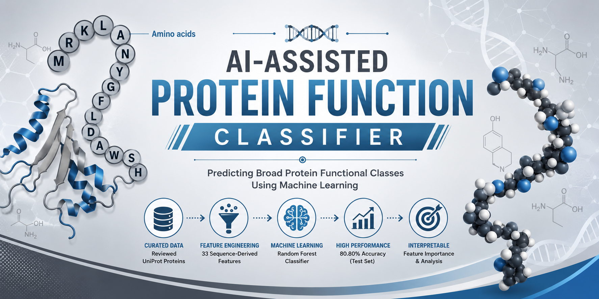
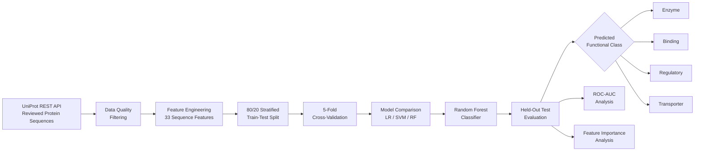

<p align="center">
  
</p>
<p align="center">
  <h1 align="center">🧬 AI-Assisted Protein Function Classifier</h1>
</p>

<p align="center">
  A biomedical <b>Machine Learning-based Protein Functional Classification System</b> that analyzes primary amino-acid sequences and predicts broad protein functional classes using sequence-derived features and a Random Forest classifier.
</p>

<p align="center">


</p>

---

# 📖 About

**AI-Assisted Protein Function Classifier** is a biomedical machine learning project designed to predict broad protein functional classes directly from primary amino-acid sequences.

The system retrieves curated/reviewed protein sequences from the **UniProt REST API**, performs dataset quality control, converts each protein sequence into **33 sequence-derived and physicochemical features**, and trains machine learning classifiers to distinguish between four broad functional categories:

- 🧪 **Enzyme**
- 🔗 **Binding**
- 🧬 **Regulatory**
- 🚚 **Transporter**

The final system uses a **Random Forest classifier** and evaluates its performance using stratified train-test splitting, 5-fold cross-validation, confusion matrices, class-wise metrics, multiclass ROC-AUC, and feature-importance analysis.

The project is implemented as a **self-contained Jupyter/Google Colab research notebook** and is intended for academic, biomedical engineering, bioinformatics, and machine learning applications.

> ⚠️ This project is intended for academic, research, and educational purposes. It is not a clinical diagnostic system and computational predictions should not be considered experimentally validated biological annotations.

---

# 🎯 Functional Classes

The classifier predicts four broad protein functional categories:

```text
                 Protein Sequence
                        │
          ┌─────────────┼─────────────┐
          │             │             │
          ▼             ▼             ▼
       Enzyme        Binding      Regulatory
          │             │             │
          └─────────────┼─────────────┘
                        │
                        ▼
                   Transporter
````

# 🧬 System Architecture



# 🧪 Dataset

Protein sequences are programmatically retrieved from the **UniProt REST API**, focusing on reviewed/curated protein records.

## Final Dataset

| Functional Class |   Samples | Percentage |
| ---------------- | --------: | ---------: |
| Enzyme           |       280 |     25.02% |
| Binding          |       280 |     25.02% |
| Regulatory       |       280 |     25.02% |
| Transporter      |       279 |     24.93% |
| **Total**        | **1,119** |   **100%** |

The resulting dataset is approximately balanced across all four functional classes.

---

# 🧹 Dataset Quality Control

The notebook performs quality analysis before model training.

| Quality Check                      |    Result |
| ---------------------------------- | --------: |
| Initial records                    |     1,120 |
| Duplicate accessions removed       |         0 |
| Duplicate sequences removed        |         1 |
| Unclear/ambiguous proteins removed |        60 |
| **Final samples**                  | **1,119** |
| Unique accessions                  |     1,120 |
| Unique sequences                   |     1,119 |

This quality-control stage helps reduce duplicate information and ambiguous records before machine-learning training.

---

# 🤖 Machine Learning Models

The project evaluates multiple classification approaches.

### Models Compared

```text
1. Stratified Dummy Baseline
2. Logistic Regression
3. SVM — RBF Kernel
4. Random Forest
```

The **Random Forest** is selected as the final primary classifier based on its performance on the held-out test set.

### Final Random Forest Configuration

```text
Estimators:       300
Class Weight:     Balanced
Random State:     42
Parallel Jobs:    -1
```

---

# 🔄 Training & Validation

The dataset is divided using an **80/20 stratified train-test split**.

```text
Total Dataset
   │
   ├── 80% Training → 895 samples
   │
   └── 20% Testing  → 224 samples
```

The training set is evaluated using **5-fold stratified cross-validation**.

This allows the project to evaluate model stability across multiple training/validation partitions before performing the final evaluation on the independent test set.

---


# 🎯 Final Test Performance

The final model was evaluated on **224 previously unseen held-out test proteins**.

| Metric               | Final Score |
| -------------------- | ----------: |
| 🎯 Accuracy          |  **80.80%** |
| ⚖️ Balanced Accuracy |  **80.80%** |
| 📊 Macro F1          |  **0.8071** |
| 📊 Weighted F1       |  **0.8071** |
| 📈 Macro ROC-AUC     |  **0.9531** |
| 📈 Weighted ROC-AUC  |  **0.9531** |

The cross-validation accuracy of **80.67% ± 3.13%** and final test accuracy of **80.80%** show closely aligned performance on the evaluated dataset.

---

# 🛠 Tech Stack

| Technology       | Usage                          |
| ---------------- | ------------------------------ |
| Python           | Core Programming               |
| Jupyter Notebook | Research & Experimentation     |
| Google Colab     | Notebook Execution             |
| UniProt REST API | Protein Data Retrieval         |
| Biopython        | Biological Sequence Processing |
| NumPy            | Numerical Computing            |
| Pandas           | Data Processing                |
| Scikit-learn     | Machine Learning               |
| Matplotlib       | Visualization                  |
| Seaborn          | Statistical Visualization      |
| Joblib           | Model/Data Utilities           |

---

# 📂 Project Structure

```text
Protein-Function-Classifier/
│
├── Protein_Fn_Classifier.ipynb
│
├── presentation_content.txt
│
├── requirements.txt
│
├── .gitignore
│
└── models/
    └── plots/
        ├── class_distribution.png
        ├── confusion_matrix.png
        ├── feature_importance.png
        └── ROC-AUC_curve.png
```

---

# 📓 Main Project File

### `Protein_Fn_Classifier.ipynb`

The notebook contains the complete research pipeline:

```text
Data Retrieval
      ↓
Data Cleaning
      ↓
Dataset Quality Analysis
      ↓
Feature Extraction
      ↓
Train/Test Split
      ↓
Cross-Validation
      ↓
Model Comparison
      ↓
Random Forest Training
      ↓
Test Evaluation
      ↓
Confusion Matrix
      ↓
ROC-AUC
      ↓
Feature Importance
      ↓
Permutation Importance
      ↓
Protein Prediction
      ↓
Input Validation
```

The notebook is intentionally **self-contained** and serves as the primary implementation of the project.

---

# ⚙️ Local Setup

## 1. Clone the Repository

```bash
git clone https://github.com/MathuBharathi/Protein-Function-Classifier.git

cd Protein-Function-Classifier
```

## 2. Create a Virtual Environment

### Windows

```powershell
python -m venv .venv

.venv\Scripts\activate
```

## 3. Install Dependencies

```powershell
pip install -r requirements.txt
```

## 4. Open the Notebook

Open:

```text
Protein_Fn_Classifier.ipynb
```

The notebook can be executed using:

* Google Colab
* Jupyter Notebook
* JupyterLab
* VS Code

## 5. Run the Notebook

Execute the cells sequentially.

> 🌐 Internet access is required during the data collection stage because the notebook retrieves protein records through the UniProt REST API.

---

# ☁️ Google Colab

The project is designed to work as a notebook-based research workflow and can be executed in Google Colab.

Upload:

```text
Protein_Fn_Classifier.ipynb
```

Then run the notebook cells sequentially.

The required Python dependencies are listed in:

```text
requirements.txt
```

---

# 🎯 Key Highlights

✅ **1,119 curated protein sequences**

✅ **4 broad functional classes**

✅ **33 sequence-derived features**

✅ **80/20 stratified train-test split**

✅ **5-fold stratified cross-validation**

✅ **Random Forest with 300 estimators**

✅ **80.80% final test accuracy**

✅ **0.8071 Macro F1**

✅ **0.9531 Multiclass ROC-AUC**

✅ **55.80 percentage-point improvement over baseline**

✅ **Confusion matrix analysis**

✅ **Feature importance analysis**

✅ **Permutation importance analysis**

✅ **Unseen protein prediction**

✅ **Protein sequence input validation**

✅ **Reproducible notebook-based workflow**

---

# 🔮 Research Direction

The current system establishes a classical machine-learning baseline for protein functional classification.

Future research can extend this foundation using richer biological representations such as:

```text
Primary Sequence
      ↓
Evolutionary Information
      ↓
Protein Domains
      ↓
Structural Information
      ↓
Protein Language Models
      ↓
Advanced Machine Learning
```

These approaches could potentially improve generalization and provide more biologically informative representations of protein function.

---

# 📜 Disclaimer

This project is developed for **academic, research, and educational purposes**.

The predictions generated by this model should not be considered:

* Definitive protein functional annotations
* Clinical diagnoses
* Therapeutic recommendations
* Experimentally validated biological conclusions

Independent biological and experimental validation remains necessary for high-confidence protein functional characterization.

---

# 👨‍💻 Developed By

**Mathu Bharathi A**

Biomedical Engineering • Bioinformatics • Machine Learning • AI

### GitHub

[https://github.com/MathuBharathi](https://github.com/MathuBharathi)

---

# 📄 License

This project is developed for academic, research, and portfolio purposes.

© 2026 Mathu Bharathi. All Rights Reserved.
